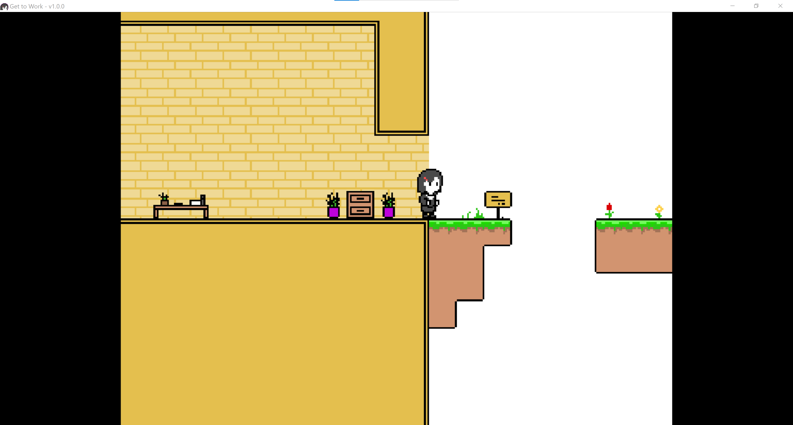

# Get to Work

A game about getting to work



## Getting Started

### Development

```
pip install -r requirements.txt
python main.py
```

### Building Release

```
./install.sh
```

Executable will be in `dist`.